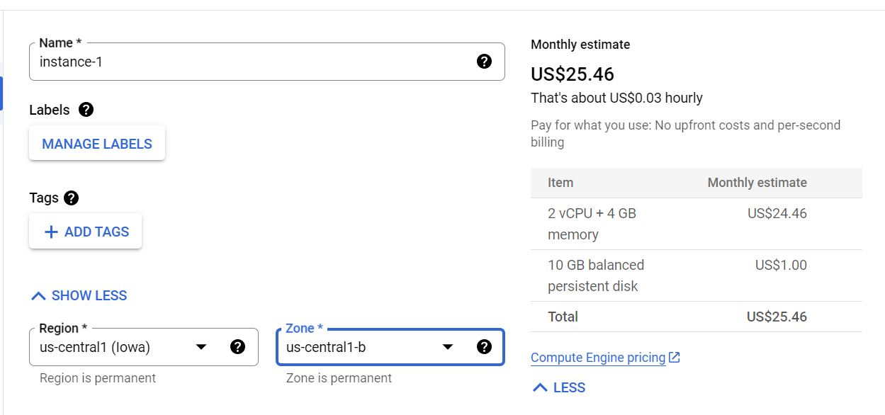

How do you automate and schedule a scraper to Google Cloud?
{:.lead}

I wrote this post in December 2020 but am reposting this from Medium. 
{:.faded}

Earlier this year I started getting into building web scrapers in R to optimise my work, having only used R for rudimentary statistical analysis prior. One of the first challenges was figuring out how to scrape javascript rendered pages using R’s pathetic scraping libraries. Once past that hurdle I was faced with another problem: how does one automate the scraper on a cloud? What seemed intuitive to cloud wizards was completely alien to a novice like myself. Despite the wealth of knowledge on StackOverflow, hours upon hours of combing only turned up partial solutions, all of which were as unintuitive as the last.

Eventually I settled on what was the least worst solution at the time. I signed up for a free trial with Google Cloud Platform (GCP), fired up Rstudio within a Virtual Machine (VM) instance, scheduled my scrapers as cron jobs and left my VM on 24/7. Needless to say this was extremely costly and inefficient. For a 30-second cron job that was run hourly I was paying about $1/day, which is like paying for a 24/7 gym membership just to use the shower (GCP gives you $300 free credits for first time users so I wasn’t actually paying, but still).

However I recently ‘discovered’ Docker and it’s been a radical game changer. I’d known about Docker before this but had avoided it largely due to its lack of an interactive environment and its heavy use of the command line. As someone used to Rstudio’s interactive layout I found both these things intimidating. But once I got used to building, running, and pushing a few images that fear turned into wonder. Docker is perfect for almost any kind of automated scraper in R since it allows one to ‘containerise’ R-base and other bare essentials. Because the scraper lives on the cloud there’s no need for fancy IDEs like Rstudio. Deploying it on GCP is also straightforward thanks to GCP’s Container-Optimized OS, which performs Docker run whenever a VM instance starts.

To spare fellow R/cloud novices the agony of plumbing the depths of StackOverflow, I’ve written a short guide for those who wish to schedule their R scraper onto GCP. I won’t go through everything in detail so I’m assuming you already know how to a) build a web scraper in R and b) run the script in a container environment. If you don’t already know how to run R in a container you can [visit this link](https://www.r-bloggers.com/2019/02/running-your-r-script-in-docker/) first to get started. I’ve also attached some useful links along the way to other resources that I found helpful.

# Preparing the R script

There’s not much else you need to do to prepare an R scraper for automation. However if you’ve been running R scrapers manually then you’ll need to find a way to create some kind of persistent storage mechanism since you’ll be running your script on the server. One way of doing this is through Dropbox, which you can access in R via the rdrop2 package. Since you’re in a non-interactive environment you won’t be able to authenticate the usual way where R opens a Dropbox web browser for you. You’ll need to [download the token](https://github.com/karthik/rdrop2#accessing-dropbox-on-shiny-and-remote-servers) and save it into either Dropbox itself (and then making it available through a link) or one of the Docker images you’re about to build. You can then authenticate from within the script by providing R the path to the token.

One of the great things about this approach is that R’s read.csv function can read CSV files directly from Dropbox. This is because Dropbox’s share links essentially become download links when you change the ‘dl=0’ extension at the end of the link to ‘dl=1’, allowing read.csv (read_csv if you’re using tidyverse) to establish a direct connection with the file. In addition Dropbox also has an option that allows links to remain persistent when files are overwritten. Both these features are gold if you’re planning on spinning up a separate Shiny app using the data you just scraped and haven’t touched relational databases yet. Being able to export to and read from a CSV saves lines of code since you don’t have to download it separately (I’ll get to that in a second) and the data structure is largely preserved.

Unfortunately the rdrop2 package can be buggy and I’ve often encountered errors when trying to export to Dropbox. Authentication and importing from Dropbox is not a problem but if you want to spin a Shiny app off the same data you just scraped then you want to be able to export and import from the same platform. This is where you might want to consider R’s googledrive package. In principle it works the same as Dropbox though less elegant. There are many ways to perform non-interactive authentication for Drive but the most robust (though slightly more troublesome) method is to [create a service account](https://cran.r-project.org/web/packages/gargle/vignettes/non-interactive-auth.html) for Drive and, similar to Dropbox, save the service account token somewhere. If you’re planning on running your Docker image from a private repo on Google’s Container Registry you can save the token into the image and get the R script to read it from there. Otherwise for security reasons you should save it into something like Dropbox and then making it available through a private link.

The catch is that using a Drive service account is not the same as using your own Google Drive. A service account has its own unique email based on your project and cannot be accessed interactively through the web, so it’s not like you can log into Google Drive on the browser and ‘see’ the files. You can however do everything you normally would (view, delete, download or add files) within R through the googledrive package’s many functions. Another major limitation is that Drive’s share links and download links are not the same, so you can’t simply run read.csv on the link. You can convert the share link to a download link if you know the format, but given that Google changes its format from time to time this is something I would avoid. Instead what you can do is to download the CSVs into temp files using the drive.download function and then read them from there. If you’re reading multiple CSVs, googledrive’s drive.ls and as_id functions can be worked into a for loop to expedite the process.

```

library(googledrive)

# download service account token

temp <- tempfile(fileext = '.json')

download.file('<DROPBOX LINK TO SERVICE ACCOUNT TOKEN>',temp)

drive_auth(path = temp)

# download CSV files from drive and read into R

d<-list()
n<-drive_ls()$id
for (i in n){
  temp <- tempfile(fileext = '.csv')
  d[which(n==i)]<-list(read.csv(drive_download(
    as_id(i), path = temp, type='csv',overwrite = TRUE)$local_path))
}


```

Finally, because Drive’s links are not persistent with each overwrite, you should use drive_upload to upload the files onto the service account first, then use drive_update in the scraper to update the files so the links (and IDs) are preserved. You can avoid all the hassle by reading and writing the data onto Google Sheets instead, which is accessible in R through the googlesheets4 package. The authentication process is exactly the same as with Drive. If you get this right it will probably save you some lines of code, but in my experience writing to and then reading from Sheets tends to warp the data structure, and you end up wasting more lines trying to wrangle the data back to its original form. It’s also a relatively new package and many of its functions are still experimental and prone to change.

# Containerising the scraper

The next step is to build a Docker image that contains all the required dependencies for your scraper. If you’re not familiar with Docker there’s an intuitive guide on [R bloggers](https://www.r-bloggers.com/2019/02/running-your-r-script-in-docker/) on how to Dockerise your script that can be finished in a couple of hours and will cover what you need. However keep in mind that running a container from your PC is different to running it from the cloud. When running on the PC you have a Dockerfile that pulls the required image from the repo then executes the R script, but there is no Dockerfile involved when deploying an image to GCP. Google uses what it calls a Container-Optimized OS which automatically performs a docker run when the VM is started. This means that the image you push to Dockerhub and deploy to the VM should be the FINAL IMAGE containing the ‘CMD Rscript’ line. I cannot stress this enough, having spent hours tinkering with GCP’s startup script in trying to execute my R script. Of course, this is working on the assumption that the image already contains everything you need and nothing more. If you want the flexibility of making additions to the container then executing the R script using startup script might be a better idea. You’d have to write a few lines in Bash but nothing too complicated — someone’s already blogged an example [here](http://scottsfarley.com/research/cloudcomputing/2016/06/05/Startup-and-Shutdown-Scripts-GCE.html.

# Deploying the image to GCP

Now let’s deploy that image to the cloud! If you don’t have a GCP account, Google provides $300 credits for a year if you’re a first time user. GCP charges based on usage, which makes it very cost efficient if you’re a personal user running small jobs. Navigating GCP can be intimidating at first but after awhile you get used to it. To run automated containers in GCP we will have to make use of the following APIs: App Engine, Compute Engine, Cloud Function, Cloud Scheduler, Cloud Pub/Sub, and Cloud Build. You don’t have to enable them all at first; Google will remind you to enable them later when you need them.

Here’s how it works. Using Compute Engine we build a VM instance through which we deploy our image. If you’re not familiar with VMs just think of it as a virtual computer. It’s a virtual computer living on a cloud that you can turn on and off, but instead of having Windows and Microsoft Office and all these things it’s going to contain only whatever you’ve built in your image. If you’ve fired up containers before you should already be familiar with this concept. Using Cloud Function, we create functions to start and stop the VM instance. Then, using Cloud Scheduler, we trigger the functions to run at whatever timings and frequency we choose through Cloud Pub/Sub triggers. The people at Google have written an excellent step by step guide [here](https://cloud.google.com/scheduler/docs/start-and-stop-compute-engine-instances-on-a-schedule#console_2) which takes you through the whole process. However the guide’s portion on creating a VM instance is lacking in detail so I’ll walk you through that portion here. Before that you should at least go through the ‘Before you begin’ section in the guide to set up the environment and enable APIs. Once that’s done, come back here to create your VM instance.


To create your VM instance, start by navigating to the Compute Engine console, then click ‘create’. Set the name, region, and zone to whatever is appropriate. Note that you can only deploy one image to one VM instance, so think about that when selecting the name. The region and zone is not referring to your physical location but rather where your resource will be hosted. If you’re deploying multiple resources Google recommends that you host them in different locations to reduce the risk of physical infrastructure failure. But if you’re a novice and a personal user like myself then it doesn’t make much difference. The default region and zone is ‘us-central-1a’, which I recommend you change to ‘us-west-1b’ since this will make creating the cloud functions easier later on. You also have to add a label, which is something your cloud function will identify your instance by. Enter ‘env’ for key and whatever you want for value just as long as it matches the label for your cloud function later. For convenience we use Google’s example which is ‘dev’.



Next, check the ‘Container’ option and specify the image URL. If you’re using Dockerhub make sure the image is public. The format is ‘docker.io/<username>/<docker-repo>:<tag>’. Alternatively you may want to use Google’s own Container Registry if you have private images you wish to deploy. To do that you’ll have to set up Docker to grant access to GCR by following the steps in [this tutorial](https://cloud.google.com/container-registry/docs/advanced-authentication). I’m using my own public Dockerhub repo so we’ll skip that for now. Since I’m running tiny jobs on my instance I decided to go with micro for machine type, which is the lowest tier.


Click on show advanced container options and check ‘Run as privileged’ to give your VM privileged access to your container. ‘Restart policy’ refers to when the VM should restart the container, which I set to restart on failure following advice on [another guide](https://minimaxir.com/2018/11/cheap-cron/). If you want to mount a volume to a cloud or PC directory you can also do it here, which is a lot handier than Docker’s ‘-v’ flag when calling Docker run.


For the boot disk you can choose from a list of OS versions but I find it better to leave it as default. GCP charges $0.04/month/GB for the boot disk with the minimum size being 10GB, which works up to just $0.40/month. For service account there is an option to change to the Drive service account if you’ve created one — I’m not sure if that would help with the Drive authentication but someone can try it and let me know. Otherwise just leave it as default.

To specify a startup script click on the ‘Management, security, networking, sole tenancy’ option in blue and scroll down to the ‘Automation’ portion. #! /bin/bash just indicates that the succeeding lines should be interpreted as Bash. If your script is already set to run in your image then this is not necessary. Again for a more comprehensive treatment of startup scripts you should refer to this example [here](http://scottsfarley.com/research/cloudcomputing/2016/06/05/Startup-and-Shutdown-Scripts-GCE.html).

When you’re all done, click create and voila, your VM instance will be up and running! Now since our scraper only scrapes once every time the VM is turned on, we want to be able to turn it off and on at regular intervals. In theory you could set up a cron job within your R script and then leave your VM on 24/7, but this is huge waste of resources. What we want to do instead is to schedule starts and stops for our VM using Cloud Function and Cloud Scheduler. You can follow [Google’s guide](https://cloud.google.com/scheduler/docs/start-and-stop-compute-engine-instances-on-a-schedule#console_2) for the rest of this as it’s very intuitive. If you’re having trouble with the cron format there’s a good resource [here](https://crontab.guru/) for you to cross reference.

# Checking that your scraper works

When automating a web scraper you want to make sure that the scraper is actually working, not just that it’s been scheduled to start and stop. The simplest way to do this is just to check if the data uploaded to your persistent storage (Dropbox, Drive) is up to date, but this is a cumbersome approach. Alternatively you can create a log for your R script using the logr package, send it to a persistent storage, and view it there. For me this is also undesirable as it requires physically checking a document on my part. The solution I found that works best is R’s [pushoverr package](https://www.r-project.org/nosvn/pandoc/pushoverr.html), which allows R to access the Pushover app and send messages to your mobile devices. All you have to do is set up a Pushover account, download Pushover to your devices, generate user and app keys, and specify your message, user, and app keys in R. No authentication file is needed.

```
library(pushoverr)
pushover(message = 'drive updated', 
         user="<ADD USER KEY HERE>", 
         app="<ADD APP KEY HERE>")
         
```

By placing the pushover function at the bottom of my R script, I receive a ‘drive updated’ message on my phone if my VM instance starts successfully and if the R script runs all the way to the bottom without encountering errors. Not receiving the notification tells me that there’s something wrong with the script and scraping has failed. It’s also a good way to know how long your instance should run before you shut it down. For example, if I schedule my instance to start at 7pm but I only receive the notification at 7.10pm, then I know I should schedule my instance to stop at least 10 minutes after starting. Another reason to use pushoverr is if the information you’re scraping requires immediate attention once it comes in. In my previous job as a market reporter I used to set up automated scrapers on customs websites that would alert me whenever the trade data for the month was in, allowing me to quickly write up the news article for it. This is invaluable for professions where speed is key.

# Concluding thoughts

There are many better ways to arrive at the same outcome though I think this is one of the simplest. It’s almost laughable that something this simple could’ve escaped my notice before, and yet I’m reminded of the frustration I endured trawling StackOverflow for hours on end. For beginners like myself I think this speaks to the lack of easily-digestible, beginner-friendly coding resources out there. StackOverflow is an invaluable resource but my feeling is that a lot of solutions there are either not comprehensive enough or they assume prior knowledge — in other words not beginner-friendly. Here’s hoping that this resource goes some way in helping some of you.

A final thing I wish to add. This guide assumes that you already know how to web scrape in R, but if you don’t and are thinking about it here’s my quick take: R’s web scraping libraries are clunky when it comes to dynamic web scraping. RSelenium is so glitchy and time consuming that it’s not even worth considering as an option. Ditto for PhantomJS and CasperJS which I’ve never managed to get to work. The only saving grace about scraping in R is that you can at least spin a Shiny app off the scraped data while using the same platform. From my limited experience, dynamic web scraping in R requires some creativity and a lot of patience and you’re better off using Python if you want access to better libraries. It’s not impossible, just tedious. Given how wonderful and ubiquitous Shiny is there’s a lot to be said for making better scraping libraries for R. Perhaps this is why there aren’t many resources dedicated to automating R scrapers on the cloud. One exception would be Mark Edmonson’s very comprehensive [suite of packages](https://code.markedmondson.me/r-packages/) that interacts R with GCP. Unfortunately it’s not very user-friendly and I find the authentication process rather faulty; much easier to just work with R, Docker, and GCP separately.
