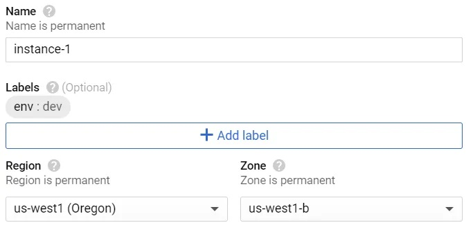
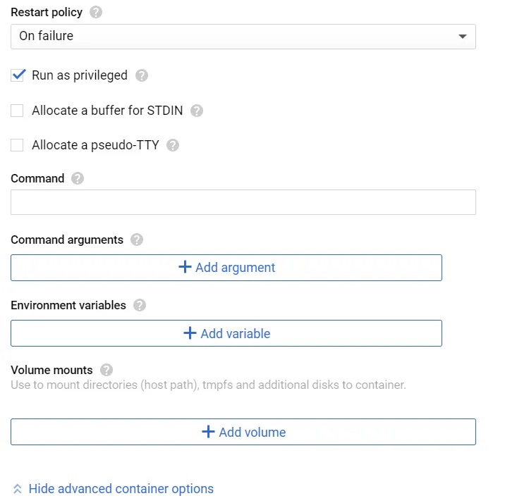

<!--**How do you automate and schedule a scraper to Google Cloud?**
{:.lead}-->

I originally published this on Medium in December 2020 but am updating and reposting this
{:.faded}

- Table of Contents
{:toc}

This post assumes that you already know how to write a script to scrape web data. Since I am predominantly an R user, this post is written mainly with R libraries in mind. <!--If you're new to scraping in R, check out my other post --> 

# What you need

For this guide you will need 1) a script that scrapes data from the web, 2) a Docker account, and 3) a Google Cloud Platform (GCP) account. Docker is necessary to "containerize" your script and GCP is needed to execute the containerized image at scheduled intervals. I will explain these terms in a moment. There are other cloud options but I use GCP because I prefer staying within the Google architecture and it also gives new users $300 of free credits to play with. This is not to be scoffed at because if you do it right, your scraper should consume only minimal resources and $300 will go a long way.


Let's assume you have a script that looks like this:

```
library(rvest)

# grab url

url <- 'https://en.wikipedia.org/wiki/List_of_international_goals_scored_by_Lionel_Messi'

# get table of goals scored

messi_goals <- url |>
  read_html() |>
  html_node("table.wikitable.sortable") |>
  html_table(fill = TRUE)
  
write.csv(messi_goals, "out/messi_goals.csv")

```

This script returns a dataframe of all international goals scored by Lionel Messi for Argentina and saves it into `/out` as a CSV. 

If we want to schedule our scraper onto the cloud, it is also likely that we want our data output to be saved on the cloud, in a way that we can access regularly. We can do this by saving it into any form of cloud storage - dropbox, googledrive, etc. Since we are using Google cloud later, I will demonstrate here how to save into a googledrive account.

# Setting up a service account

The first thing we need to do is to create a Google service account which you can do by following this [instructional](https://cloud.google.com/iam/docs/service-accounts-create). A service account gives you access to all of google drive's features (including storage), but unlike your personal google drive account there is no interactive UI. You communicate with the service account solely via the API and you can create as many of them as you want. They usually have an email designation that looks like "leo-messi-goals@<project-name>-12345.iam.gserviceaccount.com". After we've created the account, we also need to create a key that lets us authenticate without having to log in manually. Under the accounts page, look for the account you created and under Actions, click Manage keys. Click "add key" -> "create a new key" and choose the JSON option. A download window will immediately pop up - save this key into your scraper project folder as we will need it later. This is the only time you get to save the key - if you do not you will have to delete and create a new one again.

# Modify R script

We now need to modify our script to save our scraped data onto our googledrive. 

```
library(rvest)
library(googledrive)

# authenticate

drive_auth(path = "<token path here>")

# grab url

url <- 'https://en.wikipedia.org/wiki/List_of_international_goals_scored_by_Lionel_Messi'

# get table of goals scored

messi_goals <- url |>
  read_html() |>
  html_node("table.wikitable.sortable") |>
  html_table(fill = TRUE)
  
# create a temporary file and save

temp <- paste0(tempdir(), "\\messi_goals.csv")

write.csv(messi_goals, temp)

# now upload this file to your account

drive_upload(temp, overwrite = TRUE)

```

If you need to download the scraped CSV at some point, you can run the following script:

```
library(googledrive)
library(dplyr)

drive_auth(path = "<token path here>")

id <- drive_ls() %>% 
  filter(name=="messi_goals.csv") %>% 
  .$id
  
drive_download(as_id(id))

```

# Containerize script

The script is now ready, but we cannot simply throw this into the cloud and expect GCP to know how to run an R script. It needs to have a basic OS, an installation of R, and commands that tell it what to do. This is where Docker comes in. Docker is a powerful tool that allows you to create an "image". An image is something that gives a computer all the information needed to execute all these tasks from scratch. The best part of Docker is that it is open source and you can latch onto base image layers that others have created and simply add your script on top of it. You don't need to know how to write a script that installs Linux or R, because someone's already done it. In fact there are people who create R images that already come with an OS and certain popular libraries like tidyverse installed. 

To create a Docker image, go ahead and create a Docker account and a repository. The repository is where your image will live and be pulled from GCP later on. Next, install Docker on your computer and make sure your terminal has access to it. To test this, go to your terminal and run `docker run hello-world`. Once you confirm that it works, we need to create a Dockerfile. A Dockerfile is a text file that's almost like a recipe; it tells Docker step by step what ingredients are needed to make the image.

To create a Dockerfile, fire up any text editor (notepad will do) and copy the following script over: 

```
# Base image https://hub.docker.com/u/oliverstatworx/
FROM oliverstatworx/base-r-tidyverse:latest
## create directories
RUN mkdir -p /code
RUN mkdir -p /token
## copy files
COPY /code/install_packages.R /code/install_packages.R
COPY /code/scrape_data.R /code/scrape_data.R
COPY /token/token.json /token/token.json
## run the script
RUN Rscript /code/install_packages.R
CMD Rscript /code/scrape_data.R

```
You can create any kind of Dockerfile you like but this is a good base to start with. What this does is, it first imports a base image that already has debian and R with tidyverse installed. It then creates the folders "code" and "token", copies the scripts "install_packages.R" and "scrape_data.R" into the code folder and the token "token.json" into the token folder. These file paths are all relative to the root of your project folder and you should adapt them to your actual configuration. The "install_packages.R" script is a simple script that installs packages you need which may not exist in the base image. You can ignore it if all your work can be done in the base image. 

If `RUN` runs an R script, why do we specify `CMD` for our scraper? Docker runs each line sequentially when the image is created but `CMD` tells it to run *only when the image is pulled*. This means that installation is done *only once* when you build the image and every time you pull, Docker knows to execute only `CMD` commands and ignore all else above.

Once you have configured your Dockerfile, save it in your root folder **without** any extensions under the name "Dockerfile". Go to your terminal in Rstudio and run `docker build -t <Docker username>/<repo name>:<tag name> .`. The -t flag specifies that you wish to tag the image. Think of tagging as versioning; you can create different versions of the same image under different tags. The period `.` after the tag is easily missed but important since it tells Docker to use the Dockerfile in your current directory. Your image should appear in the Docker GUI once it is finished building. From there, you can fire up a container from the image which will execute the script every time it's run. Remember also to push the image to Dockerhub since we will need to pull the image later.

# Pulling the image from Google

Now that you have both a script and an image, you can fire up a container and scrape data anytime you want without opening up Rstudio. But what we really want is for Google to do this for us in the cloud without us even touching it.

To do this we will need to use a virtual machine (VM). A VM is a computer that lives on a cloud that you can turn on and off, but instead of having Windows and Microsoft Office and all these things it’s going to contain only whatever you’ve built in your image. GCP offers VM capabilities through its Compute Engine API which you have to first manually enable.

## Creating a VM

To create a VM, go to the Compute Engine sidebar option in your GCP console and click "create instance". Set the name, region, and zone to whatever is appropriate. Note that you can only deploy one image to one VM instance, so think about that when selecting the name. The region and zone is not referring to your physical location but rather where your resource will be hosted. If you’re deploying multiple resources Google recommends that you host them in different locations to reduce the risk of physical infrastructure failure. But if you’re a novice and a personal user like myself then it doesn’t make much difference. You also have to add a label, which is something your cloud function will identify your instance by. Enter "env" for key and whatever you want for value just as long as it matches the label for your cloud function later. For convenience we use Google’s example which is "dev".



For the machine configuration, it depends on how computationally intensive your scraper is. The standard option is the E2-medium which should be fine for most tasks. Note that the monthly price estimate that is shown is the cost of running the machine **perpetually** across an entire month. Your actual usage will be much lower than that because all you need to do is to turn on and off the machine whenever you need to scrape. For myself I pay only about $3 monthly to maintain 3-4 scrapers that run twice a day. 

Once you've made a choice, scroll down and click "deploy container" under the Container option. For the image name, you need to specify the Docker image URL which follows the convention `docker.io/<username>/<docker-repo>:<tag>`. Make sure that your Docker repository is set to public first. If you want to run private images you will need to use Google's own Container Registry which you can check out [here](https://cloud.google.com/container-registry/docs/advanced-authentication).

<p align="center">
  
</p>

### Persistent storage

Our script currently saves the scraping output onto googledrive, but this is not necessary. Another way to do it is to mount a volume to your container. This allows you to "link" a directory in a container to an external directory. Files that are saved within the container are then visible in that mounted directory. We need to do this because containers are self-contained and once a container is killed, the files inside disappear. Because a VM is like a computer, it will also have persistent storage that we can use to "link" to the container directory. In this way the scraper output is saved into our VM instead of just into the container. 

To do this, scroll down to the bottom of the container settings and click "add a volume mount". We will leave the volume type as directory - this means using the storage space of the VM we create. The mount path refers to the path within the container that our output will be saved, in this case `/out`. The host path refers to the path within the VM that we will link to the container. Note that not all host directories are writable - GCP specifies [here](https://cloud.google.com/container-optimized-os/docs/concepts/disks-and-filesystem) which directories we can write data in. We use here `/home/out` - there is no need to create the `out` directory in `/home`; GCP creates the directory automatically when mounting the volume if it does not already exist. For mode we change this to read/write because we want to be able to write files into this directory.

<p align="center">
  
</p>

>After creating the VM, you can access the files anytime by SSH-ing into your VM. In the GCP console, go to your VM instances, and you will see a column "Connect" with the letters SSH underneath. Clicking on it when your VM is started will allow you to enter your VM and download the output by specifying the directory path. which in this case is `/home/out/<enter your filename>.csv`.

Finally, for the boot disk you can choose from a list of OS versions and sizes but I find it better to leave it as default. GCP has increased its prices from a few years ago when I first started, up from $0.04/month/GB to $0.10/month/GB, but this is still very affordable. When you’re all done, click create and voila, your VM instance will be up and running! 

## Scheduling a VM to turn on and off at intervals

Currently our scraper only scrapes each time the VM is turned on, so what we want is to be able to turn it off and on at regular intervals. For this we will use GCP's Cloud Function and Cloud Scheduler. The entire process is not difficult but requires many steps, all of which Google have outlined in a well written [guide](https://cloud.google.com/scheduler/docs/start-and-stop-compute-engine-instances-on-a-schedule#console_2). Rather than repeat these steps it's far easier if you follow those instructions and then come back here.

<!--

# Checking that your scraper works

When automating a web scraper you want to make sure that the scraper is actually working, not just that it’s been scheduled to start and stop. The simplest way to do this is just to check if the data uploaded to your persistent storage (Dropbox, Drive) is up to date. However sometimes this is not an efficient approach. In my previous job as a market reporter I had to write news reports on fresh trade data whenever they came in, but one could not be sure exactly when this was. To facilitate this, I ran a few scrapers that would scrape customs websites for data and send a notification to my phone whenever the data for the month was in. To do this I used the `pushoverr` [package](https://www.r-project.org/nosvn/pandoc/pushoverr.html), which allows R to access the Pushover app and send messages to your mobile devices. All you have to do is set up a Pushover account, download Pushover to your devices, generate user and app keys, and specify your message, user, and app keys in R. No authentication file is needed.

```
library(pushoverr)

pushover(message = 'drive updated', 
         user = "<ADD USER KEY HERE>", 
         app = "<ADD APP KEY HERE>")
         
```

-->

# Concluding thoughts

There are many ways to arrive at the same outcome though I think this is one of the simplest. Containers and cloud computing are powerful tools that open many possibilities to even novice programmers like myself. That being said, I think people who are looking to scrape complex data may be better off working in Python. In my experience, rvest works for simple html content, but nowadays many pages are rendered in JS and R's dynamic scraping libraries either do not work or are poorly maintained. Rselenium is one way to do it but to me it is inefficient and not at all beginner friendly. The online support for it is also weak. There are ways to scrape JS content in R without using Selenium which I may cover in a separate post. 
