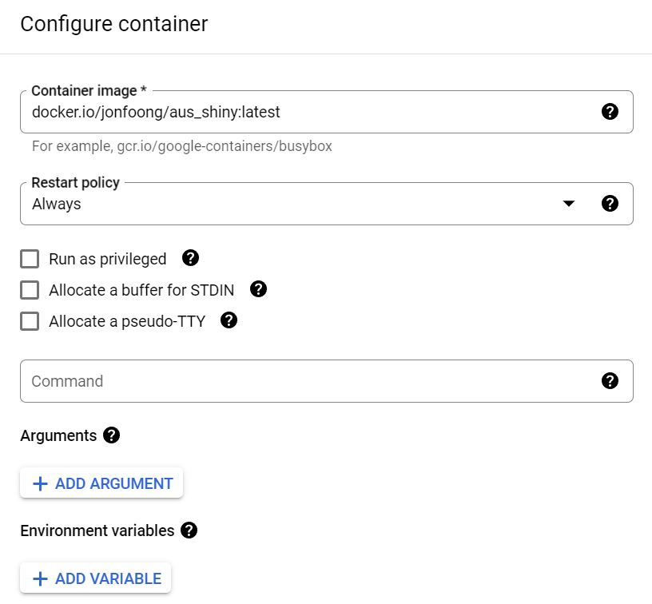

How do you automate and schedule a scraper to Google Cloud?
{:.lead}

I originally published this on Medium in December 2020 but am updating and reposting this
{:.faded}

This post assumes that you already know how to write a script to scrape web data. Since I am predominantly an R user, this post is written mainly with R libraries in mind. <!--If you're new to scraping in R, check out my other post --> 

For this guide you will need 1) a script that scrapes data from the web, 2) a Docker account, and 3) a Google Cloud Platform (GCP) account. Docker is necessary to "containerize" your script and GCP is needed to execute the containerized image at scheduled intervals. I will explain these terms in a moment. For the cloud option Azure and AWS are bigger players but I use GCP because I prefer staying within the Google architecture and it also gives new users $300 of free credits to play with. This is not to be scoffed at because if you do it right, your scraper should consume only minimal resources and $300 will go a long way.


Let's assume you have a script that looks like this:

```
library(rvest)

# grab url

url <- 'https://en.wikipedia.org/wiki/List_of_international_goals_scored_by_Lionel_Messi'

# get table of goals scored

messi_goals <- url |>
  read_html() |>
  html_node("table.wikitable.sortable") |>
  html_table(fill = TRUE)
  
write.csv(messi_goals, "messi_goals.csv")

```

This script returns a dataframe of all international goals scored by Lionel Messi for Argentina and saves it into the root directory as a CSV. However, if we want to schedule our scraper onto the cloud, we need our data to also be saved onto the cloud. R has access to many cloud options via APIs including Dropbox and Google Drive. The former via the `rdrop2` package and the latter via `googledrive`. They work similarly except `rdrop2` is no longer regularly maintained at time of writing and `googledrive` is part of the `tidyverse` suite of packages and so has excellent support. For that reason I recommend going with `googledrive` as this also allows us to stay within the Google architecture.

# Setting up a service account

The first thing we need to do is to create a Google service account by following this [instructional](https://cloud.google.com/iam/docs/service-accounts-create). A service account gives you access to all of google drive's features (including storage), but unlike your personal google drive account there is no interactive UI. You communicate with the service account solely via the API and you can create as many of them as you want. They usually have an email designation that looks like "leo-messi-goals@<project-name>-12345.iam.gserviceaccount.com". Now that we have the account, we also need to create a key that lets us authenticate without having to log in manually. Under the accounts page, look for the account you created and under Actions, click Manage keys. Click "add key" -> "create a new key" and choose the JSON option. A download window will immediately pop up - save this key into your scraper project folder as we will need it later. This is the only time you get to save the key - if you do not you will have to delete and create a new one again.

# Modify R script

We now need to modify our script to save our scraped data onto the cloud. 

```
library(rvest)
library(googledrive)

# authenticate

drive_auth(path = "<token path here>")

# grab url

url <- 'https://en.wikipedia.org/wiki/List_of_international_goals_scored_by_Lionel_Messi'

# get table of goals scored

messi_goals <- url |>
  read_html() |>
  html_node("table.wikitable.sortable") |>
  html_table(fill = TRUE)
  
# create a temporary file and save

temp <- paste0(tempdir(), "\\messi_goals.csv")

write.csv(messi_goals, temp)

# now upload this file to your account

drive_upload(temp, overwrite = TRUE)

```

If you need to download the scraped CSV at some point, you can run `drive_download()` and specify the file ID. File IDs can be obtained by running `drive_ls()`. 

```
library(googledrive)
library(dplyr)

drive_auth(path = "<token path here>")

id <- drive_ls() %>% 
  filter(name=="messi_goals.csv") %>% 
  .$id
  
drive_download(as_id(id))

```

# Containerize script

The script is now ready, but we cannot simply throw this into the cloud and expect GCP to know how to run an R script. It needs to have a basic OS, an installation of R, and commands that tell it to run the script. This is where Docker comes in. Docker is a powerful tool that allows you to create an "image", which is something that gives a blank computer all the information needed to execute all these tasks from scratch. The best part of Docker is that it is open source and you can latch onto base image layers that others have created and simply add your script on top of it. You don't need to know how to write a script that installs Linux or R, because someone's already done it. In fact there are people who create R images that already come with an OS and certain popular libraries like tidyverse installed. 

To create a Docker image, you first need to create an account and then a repository. The repository is where your image will live and be pulled from GCP later on. Next, install Docker on your computer and make sure your terminal has access to it. To test this, go to your terminal and run `docker hello-world`. Once you confirm that it works, we need to create a Dockerfile. A Dockerfile is a text file that's almost like a recipe; it tells Docker step by step what ingredients are needed to make the image.

To create a Dockerfile, fire up any text editor (notepad will do) and copy the following script over. You can create any kind of Dockerfile you like but this is a good base to start with. What this does is, it first imports a base image that already has debian and R with tidyverse installed. It then creates the folders "code" and "token", copies the scripts "install_packages.R" and "scrape_data.R" into the code folder and the token "token.json" into the token folder. These file paths are all relative to the root of your project folder like it usually is with Rstudio projects and you should adapt them to your actual configuration. The "install_packages.R" script is a simple script that installs packages you need which may not exist in the base image. Docker runs each line sequentially when the image is created but `CMD` tells it to run *only when the image is pulled*. This means that installation is done *only once* when you build the image and every time you pull, Docker knows to immediately execute only the scraper.

```
# Base image https://hub.docker.com/u/oliverstatworx/
FROM oliverstatworx/base-r-tidyverse:latest
## create directories
RUN mkdir -p /code
RUN mkdir -p /token
## copy files
COPY /code/install_packages.R /code/install_packages.R
COPY /code/scrape_data.R /code/scrape_data.R
COPY /token/token.json /token/token.json
## run the script
RUN Rscript /code/install_packages.R
CMD Rscript /code/scrape_data.R

```

Once you have configured your Dockerfile, save it in your root folder **without** any extensions under the name "Dockerfile". Go to your terminal in Rstudio (you can also use any other terminal but then you will need to cd into the directory which is cumbersome) and run `docker build -t <Docker username>/<repo name>:<tag name> .`. The -t flag specifies that you wish to tag the image. Think of tagging as versioning; you can create different versions of the same image under different tags. The period `.` after the tag is easily missed but important since it tells Docker to use the Dockerfile in your current directory. Your image should appear in the Docker GUI once it is finished building. From there, you can fire up a container from the image which will execute the script every time it's run. 

# Pulling the image from GCP

Now that you have both a script and an image, you can fire up a container and scrape data anytime you want without opening up Rstudio. But what we really want is for Google to do this for us in the cloud without us even touching it.

To do this we will need to use a virtual machine (VM). A VM is essentially a computer that lives on a cloud that you can turn on and off, but instead of having Windows and Microsoft Office and all these things it’s going to contain only whatever you’ve built in your image. GCP offers VM capabilities through its Compute Engine API which as with all its APIS you need to first manually enable.

## Creating a VM

To create a VM, go to the Compute Engine sidebar option in your GCP console and click "create instance". Set the name, region, and zone to whatever is appropriate. Note that you can only deploy one image to one VM instance, so think about that when selecting the name. The region and zone is not referring to your physical location but rather where your resource will be hosted. If you’re deploying multiple resources Google recommends that you host them in different locations to reduce the risk of physical infrastructure failure. But if you’re a novice and a personal user like myself then it doesn’t make much difference. The default region and zone is ‘us-central-1a’, which I recommend you change to ‘us-west-1b’ since this will make creating the cloud functions easier later on. You also have to add a label, which is something your cloud function will identify your instance by. Enter "env" for key and whatever you want for value just as long as it matches the label for your cloud function later. For convenience we use Google’s example which is "dev".


For the machine configuration, it depends on how computationally intensive your scraper is. The standard option is the E2-medium at the time of writing and should be fine for most tasks. Note that the monthly price estimate that is shown is the cost of running the machine **perpetually** across an entire month. Your actual usage will be dramatically lower than that because all you need to do is to turn on and off the machine whenever you need to scrape. For myself I pay only about $3 monthly to maintain 3-4 scrapers that run twice a day. 

Next, scroll down and click "deploy container" under the Container option. For the image name, you need to specify the image URL which follows the convention "docker.io/<username>/<docker-repo>:<tag>". Make sure that your Docker repository is set to public first. If you want to run private images you will need to use Google's own Container Registry which you can check out [here](https://cloud.google.com/container-registry/docs/advanced-authentication). You can leave all other fields as the default.

> If you need only to store data persistently but have no need to access it later on outside the container, GCP offers an option to mount a volume to your container. Think of the volume as a drive or a folder that is persistent no matter how many times your image is being pulled. I suggested google drive as the cloud storage medium because more often than not we want to be able to extract the scraped data and view or analyze it at a later stage. But mounting a volume is useful if you need to scrape data, save it somewhere first and turn off the scraper, then return to it later on to perform data manipulation or analysis using a different script.




Finally, for the boot disk you can choose from a list of OS versions and sizes but I find it better to leave it as default. GCP has increased its prices from a few years ago when I first started, up from $0.04/month/GB to $0.10/month/GB, but this is still very affordable. When you’re all done, click create and voila, your VM instance will be up and running! 

## Scheduling a VM to turn on and off at intervals

Now since our scraper only scrapes once every time the VM is turned on, we want to be able to turn it off and on at regular intervals. For this we will need GCP's Cloud Function and Cloud Scheduler. The entire is not difficult but requires many steps, all of which Google have outlined in a well written [guide](https://cloud.google.com/scheduler/docs/start-and-stop-compute-engine-instances-on-a-schedule#console_2). Rather than repeat these steps it's far easier if you follow those instructions and then come back here. If you’re having trouble with the cron format there’s a good resource [here](https://crontab.guru/) for you to cross reference.

# Checking that your scraper works

When automating a web scraper you want to make sure that the scraper is actually working, not just that it’s been scheduled to start and stop. The simplest way to do this is just to check if the data uploaded to your persistent storage (Dropbox, Drive) is up to date. However sometimes it may not be efficient to physically check if the data is there. In my previous job as a market reporter I had to write news reports on fresh trade data whenever they came in, but one could not be sure exactly when this was. To facilitate this, I ran a few scrapers that would scrape customs websites for data and send a notification to my phone whenever the data for the month was in. To do this I used the `pushoverr` [package](https://www.r-project.org/nosvn/pandoc/pushoverr.html), which allows R to access the Pushover app and send messages to your mobile devices. All you have to do is set up a Pushover account, download Pushover to your devices, generate user and app keys, and specify your message, user, and app keys in R. No authentication file is needed.

```
library(pushoverr)

pushover(message = 'drive updated', 
         user = "<ADD USER KEY HERE>", 
         app = "<ADD APP KEY HERE>")
         
```

# Concluding thoughts

There are many ways to arrive at the same outcome though I think this is one of the simplest. Containers and cloud computing are powerful tools that open many possibilities to even novice programmers like myself. That being said, I think people who are looking to scrape complex data may be better off working in Python. In my experience, rvest works for simple html content, but nowadays many pages are rendered in JS and R's dynamic scraping libraries either do not work or are poorly maintained. Rselenium is one way to do it but to me it is inefficient and not at all beginner friendly. The online support for it is also weak. There are ways to scrape JS content in R without using Selenium which I may cover in a separate post but they do not always work.
